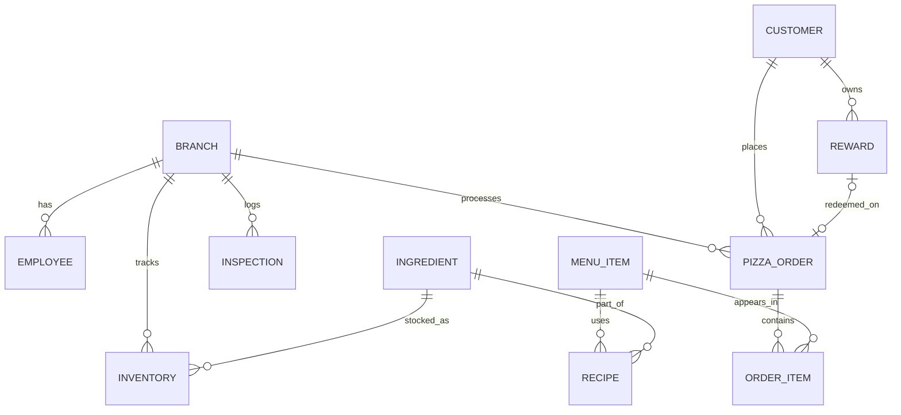

# Rita's Pizza Presentation Script: Sections 2 and 3

Estimated speaking time: about 4.5 to 5 minutes total.

Recommended visual:
Use the existing ER diagram from `part1/er-diagrams.pdf` if you already have it on a slide. If you want a cleaner presentation visual, you can also use this simplified Mermaid diagram.

## 2. Database Schema

For our database schema, we designed the system around the main things Rita's Pizza needs to track in day-to-day operations.

At the center of the design is the `BRANCH` table, because each location is really the hub of the business. Every branch has employees, processes orders, keeps its own inventory, and receives inspections over time. That made branch data a natural starting point for the schema.

From there, we built out the employee side with the `EMPLOYEE` table. Each employee belongs to one branch, and each branch has one manager linked back through `manager_id`. We also restricted employee roles to the specific job types we defined in our business rules, like general manager, shift manager, kitchen staff, and cashier.

On the customer and sales side, we used `CUSTOMER`, `PIZZA_ORDER`, and `REWARD`. One important design choice was allowing walk-in orders, so an order does not always have to be tied to a registered customer. That makes the system more realistic for a pizza restaurant where some people order at the counter without creating an account. At the same time, rewards are only tied to registered customers, so loyalty features stay separate from anonymous orders.

To handle the contents of an order, we used `ORDER_ITEM` as a bridge between `PIZZA_ORDER` and `MENU_ITEM`. That is important because one order can contain many menu items, and the same menu item can appear in many different orders. `ORDER_ITEM` also stores the quantity and item price for each line item, so it supports real order detail instead of just a simple order total.

For kitchen operations, we connected `MENU_ITEM` to `INGREDIENT` through the `RECIPE` table. That lets us show exactly which ingredients are needed for each menu item and how much of each ingredient is required. Then we connected `BRANCH` to `INGREDIENT` through `INVENTORY`, which lets every branch maintain its own stock levels independently.

The main primary keys are the ID fields in each major table, like `branch_id`, `employee_id`, `customer_id`, and `order_id`. The foreign keys create the relationships between those tables, and the three associative tables use composite primary keys to represent many-to-many relationships cleanly.

Overall, this schema supports the core functionality of the business: branch operations, employee assignment, customer accounts, order processing, line items, menu recipes, branch-level inventory tracking, health inspections, and one-time reward redemption.

## 3. Implementation

For the implementation, we built the database in MySQL 8.4 and ran it through Docker Compose so the whole system can be started locally in a consistent way. That gave us a repeatable environment without needing a manual database setup on each machine.

We created a full schema file that builds all 11 tables, sets up primary keys and foreign keys, and adds checks and uniqueness constraints where they make sense. For example, employee roles are restricted to approved values, order type is limited to online or in-person, prices and quantities cannot be negative, each branch has a unique manager reference, and each reward can be linked to at most one order.

One implementation detail we had to handle carefully was the circular relationship between branches and employees. A branch stores its manager, but employees also store the branch they work at. We handled that by creating the tables in stages and adding the manager foreign key after the employee table exists.

We also built a Python seed script to generate realistic sample data instead of manually typing only a few records. By default, that script creates 5 branches, 30 employees, 80 customers, 18 menu items, 30 ingredients, 60 rewards, 200 orders, branch inspections, recipes, and inventory rows. That gave us a much richer dataset to test and demonstrate the system.

In terms of business logic, some rules are enforced directly by the database design, and some are reflected in the seed behavior. For example, registered customers can place either online or in-person orders, while walk-in orders are treated as in-person only. Customers earn reward points based on their order totals. Rewards can be attached to an order at most once, and when a reward is used, the generated order total is discounted.

To show that the system actually works, we built example queries around real business questions instead of only selecting raw tables. Those queries can show branch sales and staffing summaries, recent orders with their line items, menu items with recipe and ingredient cost breakdowns, customer spending and reward usage, and inventory items that are running low.

So the system behavior is not just "data exists in tables." It supports realistic restaurant operations and reporting across sales, staffing, rewards, recipes, and inventory.

For tools and stack, we used MySQL, Docker Compose, and Python's standard library for data generation. We also went beyond the minimum requirements by creating a richer seeded dataset and multiple useful reporting queries instead of stopping at a few manual inserts. We did not build an API layer or a deployed web application for this version, because the focus of the project was getting the database structure and behavior working clearly and correctly.

## Shorter Closing Line

If you want a short ending sentence, use this:

"Overall, our implementation shows that the schema is not only well designed on paper, but also functional enough to support realistic restaurant data and meaningful business reporting."
